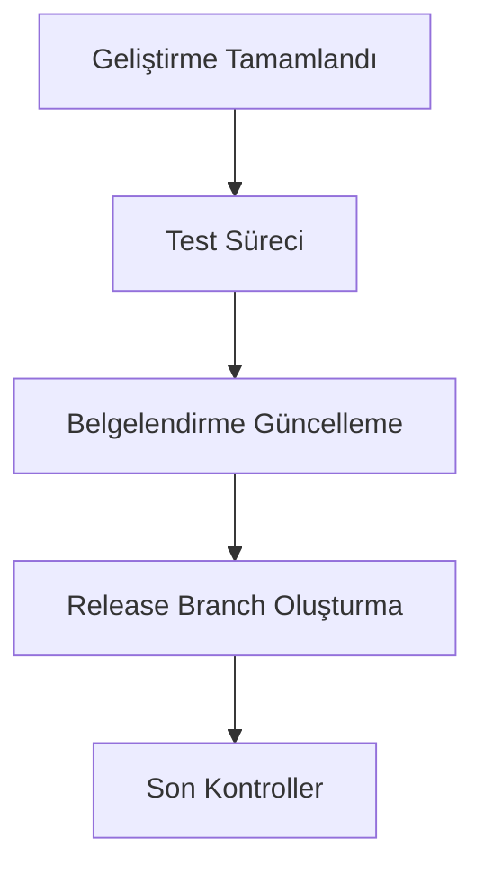
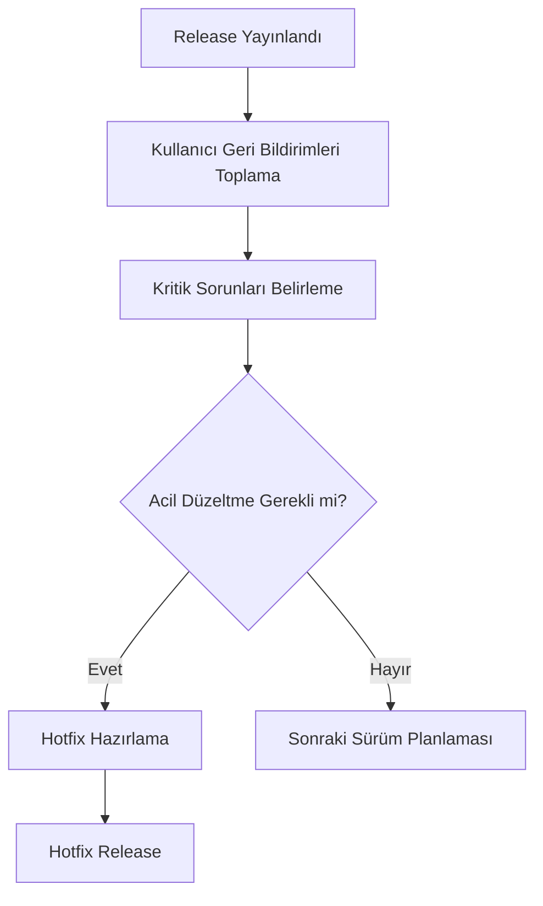

# GitHub Releases - Sudoku Uygulaması

Bu doküman, Sudoku uygulamasının GitHub Releases özelliğinin kullanımı ve bu sürecin yönetimi hakkında detaylı bilgi sağlamaktadır.

## GitHub Releases Nedir?

GitHub Releases, bir projenin belirli dönüm noktalarını (sürümlerini) etiketlemeye ve bu sürümlere ilişkin binary dosyaları, değişiklik kayıtlarını ve açıklamaları ekleyip kullanıcılara sunmaya yarayan bir özelliktir.

## Sudoku Uygulaması Release Stratejisi

### Sürüm Numaralandırma (SemVer)

Sudoku uygulaması, Semantic Versioning (SemVer) ilkelerini takip eder:

```
MAJOR.MINOR.PATCH[-PRERELEASE][+BUILD]
```

- **MAJOR**: Geriye dönük uyumlu olmayan değişiklikler
- **MINOR**: Geriye dönük uyumlu yeni özellikler
- **PATCH**: Geriye dönük uyumlu hata düzeltmeleri
- **PRERELEASE**: Alpha, beta gibi ön sürüm göstergeleri
- **BUILD**: Derleme meta verisi

### Sürüm Kategorileri

| Kategori | Örnek | Kullanım Amacı |
|----------|-------|----------------|
| Alfa Sürümü | v1.2.0-alpha.1 | İç test ekibi için erken sürümler |
| Beta Sürümü | v1.2.0-beta.2 | Dış test kullanıcıları için sürümler |
| Release Candidate | v1.2.0-rc.1 | Final sürüm öncesi son kontroller |
| Kararlı Sürüm | v1.2.0 | Genel kullanıcılara sunulan sürümler |
| Hotfix | v1.2.1 | Acil hata düzeltmeleri |

## Release Süreci

### 1. Hazırlık Aşaması



### 2. Release Oluşturma Adımları

1. GitHub repositoryde "Releases" bölümüne gidin
2. "Draft a new release" butonuna tıklayın
3. Tag sürümünü SemVer formatında girin (örn. v1.2.0)
4. Release başlığını ekleyin
5. Değişiklik kaydını (changelog) detaylı bir şekilde yazın
6. Gerekli binary dosyalarını ekleyin (IPA, APK)
7. Release'i yayınlayın

### 3. Release Notları Formatı

```markdown
## Sudoku v1.2.0

### Yeni Özellikler
- Firebase entegrasyonu ile çoklu cihaz desteği eklendi
- Yeni zorluk seviyesi: "Uzman" eklendi
- Tema değiştirme seçeneği eklendi

### İyileştirmeler
- Performans optimizasyonları yapıldı
- UI/UX geliştirmeleri
- Hızlı oyun modu eklendi

### Hata Düzeltmeleri
- Kayıtlı oyunlar sayfasında yaşanan çökme sorunu giderildi
- İpucu sistemindeki yanlış yönlendirmeler düzeltildi
- İstatistik görüntüleme sorunları çözüldü

### Bilinen Sorunlar
- Bazı özel durumlarda tema değiştirme gecikmeli çalışabilir
```

## Sudoku Uygulama Sürümleri

| Sürüm | Tarih | Ana Değişiklikler |
|-------|-------|-------------------|
| v1.0.0 | 2023-01-15 | İlk resmi sürüm |
| v1.1.0 | 2023-03-20 | İstatistik sisteminin eklenmesi |
| v1.2.0 | 2023-06-10 | Firebase entegrasyonu ve çoklu cihaz desteği |
| v1.2.1 | 2023-06-25 | Kritik Firebase senkronizasyon hatalarının düzeltilmesi |
| v1.3.0 | 2023-09-05 | Yeni ipucu sistemi ve gelişmiş UI |
| v2.0.0 | 2024-01-20 | Tamamen yenilenmiş arayüz ve oyun motoru |

## GitHub Actions ile Otomatik Release

Sudoku uygulaması, yeni bir tag oluşturulduğunda otomatik olarak bir release oluşturan GitHub Actions iş akışı kullanır:

```yaml
name: Create Release

on:
  push:
    tags:
      - 'v*'

jobs:
  build:
    runs-on: macos-latest
    steps:
      - name: Checkout code
        uses: actions/checkout@v3
        
      - name: Set up Xcode
        uses: maxim-lobanov/setup-xcode@v1
        with:
          xcode-version: '14.x'
          
      - name: Install dependencies
        run: |
          pod install --repo-update
          
      - name: Build app
        run: |
          xcodebuild -workspace Sudoku.xcworkspace -scheme Sudoku -configuration Release -archivePath ./build/Sudoku.xcarchive archive
          xcodebuild -exportArchive -archivePath ./build/Sudoku.xcarchive -exportOptionsPlist ExportOptions.plist -exportPath ./build
          
      - name: Create Release
        id: create_release
        uses: actions/create-release@v1
        env:
          GITHUB_TOKEN: ${{ secrets.GITHUB_TOKEN }}
        with:
          tag_name: ${{ github.ref }}
          release_name: Sudoku ${{ github.ref_name }}
          draft: false
          prerelease: false
          
      - name: Upload Release Asset
        uses: actions/upload-release-asset@v1
        env:
          GITHUB_TOKEN: ${{ secrets.GITHUB_TOKEN }}
        with:
          upload_url: ${{ steps.create_release.outputs.upload_url }}
          asset_path: ./build/Sudoku.ipa
          asset_name: Sudoku.ipa
          asset_content_type: application/octet-stream
```

## Release Kontrol Listesi

Her release öncesinde aşağıdaki kontrollerin yapılması gerekmektedir:

- [ ] Tüm birim testleri başarıyla geçti mi?
- [ ] UI testleri tamamlandı mı?
- [ ] Değişiklik kaydı (changelog) eksiksiz ve doğru mu?
- [ ] Sürüm numarası doğru formatta mı?
- [ ] App Store / TestFlight meta verileri güncellendi mi?
- [ ] Release branch'i son kontrollerden geçti mi?
- [ ] Dokümantasyon güncellendi mi?
- [ ] Kullanıcı geri bildirimleri değerlendirildi mi?

## Release Sonrası Süreç



## Release Güvenliği

GitHub Releases'in güvenliğini sağlamak için aşağıdaki önlemler alınmıştır:

1. **İmzalı Commit ve Tag Politikası**: Tüm release commit'leri ve tag'leri GPG ile imzalanır
2. **Release Branch Koruması**: Release branch'lerine yalnızca onaylı maintainer'lar push yapabilir
3. **Code Review Zorunluluğu**: Tüm PR'lar en az bir maintainer tarafından onaylanmalıdır
4. **Otomatik Güvenlik Taraması**: GitHub Security tarafından otomatik kod analizi 

---

Bu dokümantasyon, Sudoku uygulamasının GitHub Releases süreci hakkında kapsamlı bir bakış sağlamaktadır. Bu süreçleri takip ederek, uygulama geliştirme sürecinin daha düzenli ve güvenli ilerlemesi sağlanmaktadır. 